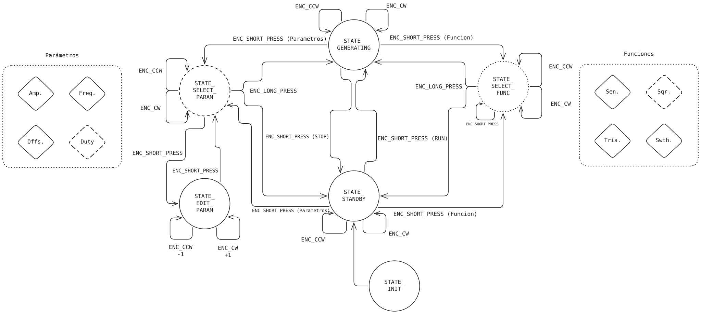
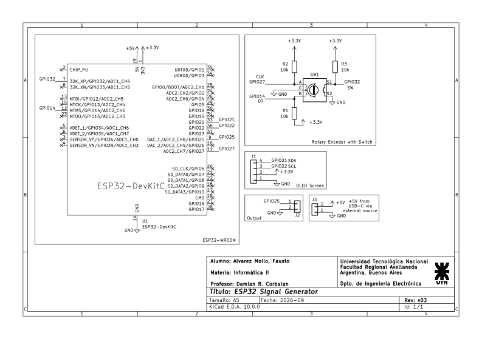

# Trabajo Práctico Integrador - Máquinas de Estado

Repositorio personal para la entrega del Trabajo Práctico Integrador de Informática II para la UTNFRA.

## Profesores
- Ing. Gustavo Viard.
- Mg. Ing. Damian Ruben Corbalan.

## Generador de Funciones con ESP32

### Resumen
El objetivo de este proyecto consiste en el diseño y la implementación de un generador de funciones digital basado en el microcontrolador ESP32-WROOM. El sistema, le permite al usuario configurar y seleccionar varios parámetros de la función a generar mediante un encoder rotativo y la visualización de los mismos mediante una pantalla.

### Objetivos
- Implementar un generador de funciones que ofrezca, múltiples formas de onda seleccionables.
- Permitir la edición de parámetros relevantes de la señal generada según la función seleccionada.
- Proporcionar una interfaz de control sencilla e intuitiva basada en un único encoder rotativo con pulsador, que facilite la navegación por los menús y el ajuste de valores.
- Diseñar una visualización clara en una pantalla que muestre el estado actual, los parámetros y las opciones disponibles.
- Estructurar el firmware mediante una máquina de estados finitos que gestione de forma robusta las transiciones entre los distintos modos de operación.

### Diseño de la FSM.

Toda la interfaz de usuario es una única máquina de estados finitos (FSM) (`generator.c` / `generator.h`), controlada mediante cuatro posibles entradas provenientes del encoder (`encoder.c`): `ENC_CW`, `ENC_CCW`, `ENC_SHORT_PRESS`, `ENC_LONG_PRESS`.

- **`STATE_INIT`**: solo existe durante un instante en el arranque; pasa inmediatamente a `STATE_STANDBY` de forma incondicional.

- **`STATE_STANDBY`**: la señal **no** se está generando. Al girar el encoder se mueve un cursor de selección sobre tres opciones: **Parámetros**, **Función**, **Run**. Una pulsación corta confirma la opción seleccionada.

- **`STATE_GENERATING`**: la señal **se está** generando (el DAC está activo). Se mantiene el mismo cursor de tres opciones, excepto que la tercera opción pasa a ser **Stop** en lugar de **Run**.

- **`STATE_SELECT_PARAM`**: lista desplazable con los cuatro parámetros (Frecuencia, Amplitud, Offset, Duty). Una pulsación corta entra en `STATE_EDIT_PARAM` sobre el parámetro seleccionado; una pulsación larga sale y vuelve al estado desde el que se ingresó.

- **`STATE_EDIT_PARAM`** — al girar el encoder se incrementa o decrementa el parámetro seleccionado según su tamaño de paso, respetando sus límites mínimo y máximo. Tanto una pulsación corta como una larga regresan a `STATE_SELECT_PARAM`.

- **`STATE_SELECT_FUNC`** — lista desplazable de formas de onda (Seno, Cuadrada, Triangular, Sierra). Una pulsación corta aplica inmediatamente la forma de onda seleccionada (y permanece en este estado, por lo que se pueden previsualizar varias consecutivamente); una pulsación larga sale y vuelve al estado desde el que se ingresó.

`STATE_SELECT_PARAM` y `STATE_SELECT_FUNC` pueden alcanzarse tanto desde `STATE_STANDBY` como desde `STATE_GENERATING`, y una variable `return_state` recuerda desde cuál de los dos estados se ingresó. De esta manera se pueden modificar la frecuencia, amplitud, offset, duty o forma de onda **mientras la señal se está generando activamente**, sin necesidad de detenerla primero.

### Descripción de archivos

| Archivo | Responsabilidad |
|---|---|
| `main.c` | `app_main`: Inicialización y luego un bucle de _polling_ de 1 ms que lee los eventos del encoder, alimenta la FSM y actualiza la pantalla únicamente cuando hubo algún cambio. |
| `generator.c` / `.h` | La FSM descrita anteriormente. Se encarga de todo el estado de la interfaz, de los valores actuales de los parámetros (mediante `waveform_set_*`) y de la bandera de ejecución/parada. |
| `encoder.c` / `.h` | Lee el encoder rotatorio y el botón. Produce los cuatro eventos de `encoder_t`. |
| `display.c` / `.h` | Renderiza cada estado de la FSM en la OLED mediante u8g2. |
| `waveform.c` / `.h` | Contiene las LUTs (_Look-up Tables_) para seno/cuadrada/triangular/sierra y el acumulador de fase; `waveform_get_sample()` se llama una vez por cada muestra de salida. |
| `dac.c` / `.h` | Un _wrapper_ sobre el driver `dac_oneshot` de ESP-IDF. |
| `sample_timer.c` / `.h` | Un callback periódico de `esp_timer` a `SAMPLE_RATE` (40kHz) que obtiene una muestra de `waveform.c` y la envía a `dac.c`, habilitado según `generator_is_running()`. |
| `sys.c` / `.h` | `init_all()` — inicializa todos los módulos en orden. |
| `config.h` | Todos los números de GPIO, los límites eléctricos (frecuencia mínima/máxima, amplitud, etc.), etc. |

### Diagrama de la Máquina de Estado

### Esquemático

### PCB Finalizado

