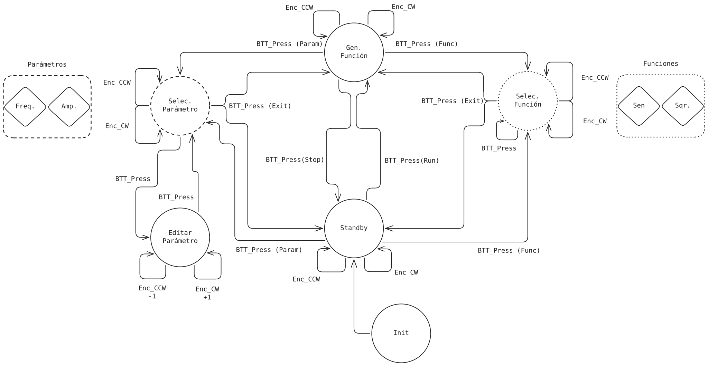

# Trabajo Práctico Integrador - Máquinas de Estado

Repositorio personal para la entrega del Trabajo Práctico Integrador de Informática II para la UTNFRA.

## Profesores
- Ing. Gustavo Viard.
- Mg. Ing. Damian Ruben Corbalan.

## Generador de Funciones con ESP32

### Resumen
El objetivo de este proyecto consiste en el diseño y la implementación de un generador de funciones digital basado en el microcontrolador ESP32. El sistema, le permite al usuario configurar y seleccionar varios parámetros de la función a generar mediante un encoder rotativo y la visualización de los mismos mediante una pantalla.

### Objetivos
- Implementar un generador de funciones que ofrezca, múltiples formas de onda seleccionables.
- Permitir la edición de parámetros relevantes de la señal generada según la función seleccionada.
- Proporcionar una interfaz de control sencilla e intuitiva basada en un único encoder rotativo con pulsador, que facilite la navegación por los menús y el ajuste de valores.
- Diseñar una visualización clara en una pantalla que muestre el estado actual, los parámetros y las opciones disponibles.
- Estructurar el firmware mediante una máquina de estados finitos que gestione de forma robusta las transiciones entre los distintos modos de operación.

### Diagrama de la Máquina de Estado

### Esquemático

### PCB Finalizado

